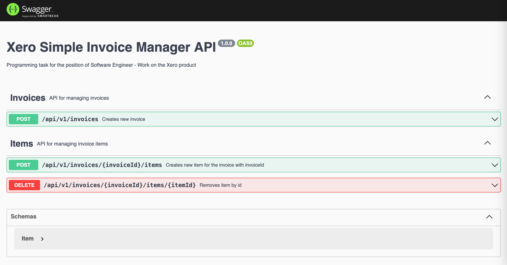

# Xero Simple Inovice Manager



Programming task for the position of [Software Engineer - Work on the Xero product](https://jobs.lever.co/xero/527b229a-e12f-4531-b744-94a5de63436b).

[Original broken console application](/xero-original-task) has been rewritten into fully blown backend application serving API endpoints. Original functions:
```
createInvoiceWithOneIem();
createInvoiceWithMultipleItemsAndQuantities();
removeItem();
mergeInvoices();
cloneInvoice();
invoiceToString();
```
have been reimplememented and tested to showcase basic concepts around JavaScript classes.

**<font color='red'>This project requires Node v14.16.0 or higher.</font>**

## Table of Contents

  - [Description](#description)
  - [Scope of Functionalities](#scope-of-functionalities)
  - [Technologies/Components](#technologiescomponents)
  - [Installation Notes](#installation-notes)
    - [Install Node](#install-node)
    - [Install Dependecies](#install-dependencies)
    - [Run Application](#run-application)
  - [Test APIs](#test-apis)
  - [API Specification](#api-specification)
  - [Backlog (unproritised)](#backlog-unprioritised)
  - [Contact](#contact)

## Description

Xero Simple Inovice Manager is an API app that allows you to manage your invoices.

## Scope of Functionalities

 - Add invoice (with or without line items)
 - Fetch all invoices
 - Fetch particular invoice
 - Update particular invoice
 - Delete particular invoice
 - Clone invoice
 - Merge invoices
 - Add line items to particular invoice
 - Remove line items from particular invoice

## Technologies/Components

 - Node (requires v14.16 or higher)
 - Express
 - Lowdb
 - Express Validator
 - SwaggerUI
 - Others ([see package.json](package.json))

## Installation Notes

Below steps are required to run the application locally.

APIs will be exposed at [localhost:5000/api/v1](http://localhost:5000/api/v1)

### Install Node

Download installer from [the Node.js website](https://nodejs.org/en/download/) and follow the instructions.

### Clone GitHub repository

```
git clone https://github.com/mj-felix/xero-simple-inovice-manager.git
```

### Install Dependencies

```
npm install
```

### Run Application

```
# Run APIs (without nodemon)
npm start

# Run APIs (with nodemon)
npm run dev
```
## Test APIs

```
# Test APIs (server needs to be running)
npm test
```

Test coverage is limited strictly to the [main functions of the original application](#xero-simple-inovice-manager).

## API Specification

Please explore [Postman collection](/postman).

Some APIs have been documented using Swagger: [localhost:5000/api/v1/docs](http://localhost:5000/api/v1/docs)

## Backlog (unprioritised)

1. Add user entity (user has many invoices, invoice can have only one user)
2. Authentication - consider:
   - Refresh token/Access token (as implmented in [TrackMyNotes by MJ Felix](https://github.com/mj-felix/track-my-notes))
   - Auth0 (as implmented in [TrackMyReading by MJ Felix](https://github.com/mj-felix/track-my-reading))
   - Other ...
3. Authorisation (e.g. given user don't have access to other users invoices and line items)
4. Confirm requirements for *merge invoice*:
   - destructive vs non-destructive
   - overwrite vs brand new copy
   - what to do with old invoices?
   - how should merge behave if the same product on the invoices being merged? what if it has different price?
5. Add Product entity (with name and price attributes) - Item holds quantity and reference to product
6. Complete Swagger documentation for all endpoints
7. Complete API tests to obtain fuller coverage (see test coverage in [TrackMyNotes by MJ Felix](https://github.com/mj-felix/track-my-notes#test-apis)) + other types of tests
8. Add more validations; especially for create and update invoice (see `*.rules.js` in [TrackMyReading by MJ Felix](https://github.com/mj-felix/track-my-reading/tree/main/backend/models))
9. Implement Invoice.update with array of fields to be updated as a parameter
10. PDF generation - considerations:
    - when to generate? expose endpoint?
    - return PDF/return link to PDF(+store it on invoice)/email PDF (if user's email is held)
    - where to store? (see integration with Amazon S3 in [TrackMyWarranties by MJ Felix](https://github.com/mj-felix/track-my-warranties#extended-setup) and [TrackMyNotes by MJ Felix](https://github.com/mj-felix/track-my-notes#extended-setup))
11. Build frontend app (web app, mobile app, desktop app)
    - CORS consideration ([npm CORS package](https://www.npmjs.com/package/cors))
12. Allow to change invoice fields (date, number) while cloning or merging
13. Consider different database ;-)
14. Document source code ([JSDocs](https://jsdoc.app)?)

## Contact

MJ Felix<br>
[mjfelix.dev](https://mjfelix.dev)<br>
mjfelixdev@gmail.com<br>
[linkedin.com/in/mszonline](https://www.linkedin.com/in/mjfelix/) 
